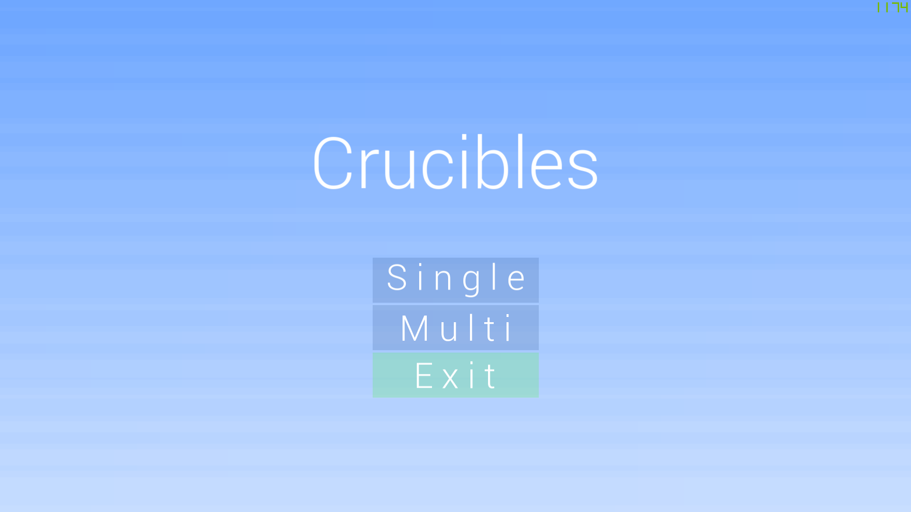
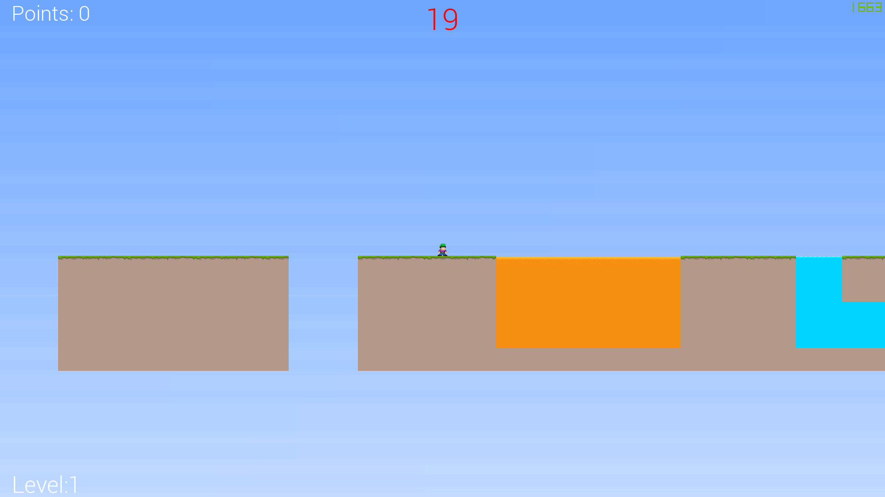
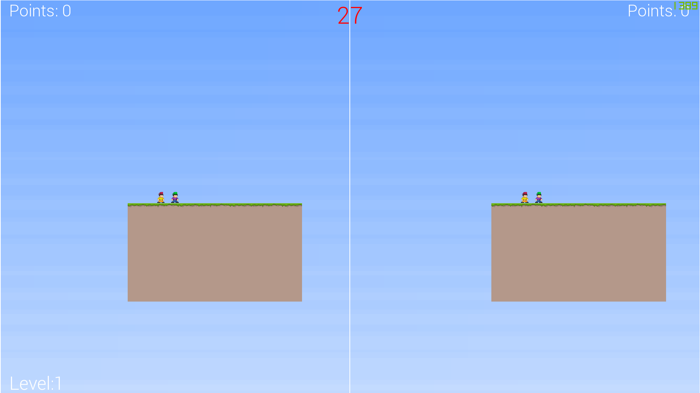

# About
This is a game made by me in C++ with the SFML library back in 2019 as a side studies project for a better grade. It is simple parkour game with 2D graphics called `Crucibles` as a reference to minecraft minigame that was made by friend. Made using multiple tutorials from books and videos mostly using `Beginning C++ Game Programming` and `Mastering SFML Game Development` by Packt.

## Main Menu
Game interface contains a main menu where user can select between single player and multiplayer which is a competiton in split screen. Also there is an exit button.



## Controls
Movement in game is based on the `WSAD` but withoud the `S`

For single player
- `W` is jump
- `A` is left
- `D` is rigt

The second player controls in multi are similar, but for arrow keys.

To resume or pause game use `Enter` key.

To show up a menu page use `Esc` key, menu page can be bot controlled using arrow keys and mouse.

## Single player
The game for a single player consists of the total points gathered in the left upper corner, time left in the middle in red and the current level number on the left bottom. Both lava and water are dangerous and can kill a player.



## Multi player (Splt screen competition)
In this type of game where to players compete who is first to win a level and get points. At the end of all levels there is a summary screen which show which player was better thus won whole competition.



# Running the game
To run a game simply download a release from a GitHub and extract the `.zip` folder. Then just duble click the `Project.exe` executable. There will be a prompt about trusting the software as it is not signed but still safe.

All of the libraries from SFML and graphics, folders and other files are contained inside this folder to ensure proper execution.

# Bulding the game
I dont recommend bulding the game for your own but if you wish here it is how to do it.

First clone this repository using this repository url and git clone command as shown below.
```
git clone https://github.com/Niewidzialny84/PlatformGameProject.git
```

Next up download a [SFML library](https://www.sfml-dev.org/download/sfml/2.5.1/) and place it in your system drive in folder such as the path so it looks like this `C:/SFML`.

Then open up `Projekt.sln` file. And you should be ready to go but, i have used a Visual Studio 2017 for this project and there can be newer or older versions that will require you to retarget the solution or download some other version of compiler and Visual Studio.

Finished compiled version should be provided with SFML `.dll` files and graphic, sound and fonts folder to run the game properly.